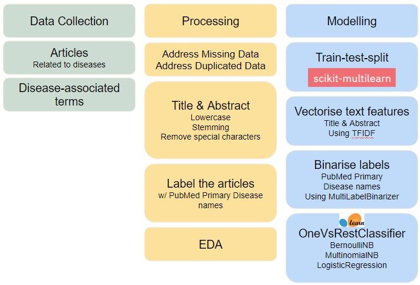
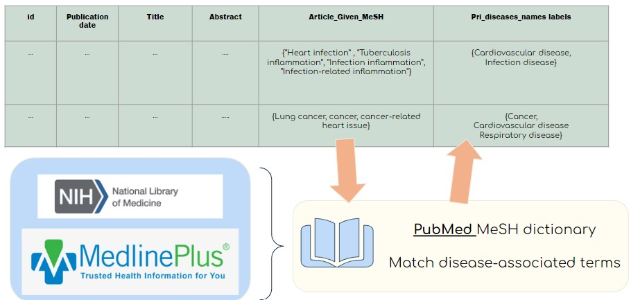
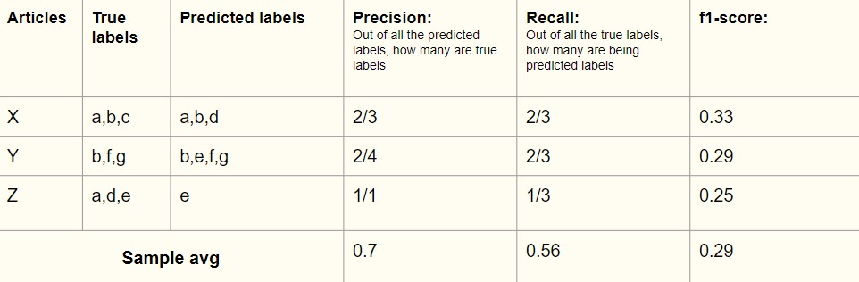

# Beauty of Text Classification in the world of Medical Science
This document provide a description of the project.
# Overview of the Project description:
[Part 1: Problem Statment](#ID_1) 
[Part 2: Dataset](#ID_2) 
[Part 3: Approach](#ID_3) 
[Part 4: Models & Evaluation](#ID_4) 
[Part 5: Discussion & Conclusion](#ID_5) 

***Notebooks in this project***:
- 01_DataCollection (a series of notebooks demonstrating how data are scraped)
- 02_DataCleaning
- 03_DataProcessing_EDA
- 04_BaselineModel
- 05_Model_Improvement

# 1. Problem Statment 

Multi-label classification can be seen in many context. For example in the world of news, we label them *'Political'*, *'Sports'* or *'Business & Finance'*. It can also be seen in the entertainment world, such as labelling a movie *'Horror'*, *'Comedy'* or *'Fantasy'*. In the science community, multi-label classification has great potential in handling huge databases of scientific publications.  
The science community as of 2021 is reported to have reached [8.8 million ](https://sciencebusiness.net/news/number-scientists-worldwide-reaches-88m-global-research-spending-grows-faster-economy) and it is still growing. Scientists conduct in-depth research on existing databases for their work and they publish their work findings into these databases as well. Publishing their work is a big deal for the scientists for various reasons: 
- To build their reputation and credibility, which in return help them in obtaining funds and career progression
- To obtain feedbacks through peer reviews
- To preserve their findings for future generations.

One of the world's most popular database is [PubMed](https://pubmed.ncbi.nlm.nih.gov/). PubMed is a life science and biomedical database managed by [National Center for Biotechnology Information (NCBI)](https://www.ncbi.nlm.nih.gov/) from the [US National Library of Medicine (NLM)](https://www.nih.gov/about-nih/what-we-do/nih-almanac/national-library-medicine-nlm). It contains over 33 million articles. Such a huge database faces challenges in handling the vast volume of data and navigating through them, including:
- Labelling the articles appropriately
- Searching for relevant articles

**Complications in labelling articles**
- Although NBCI has a standardised collection of article labels, some publishers do not follow the standardised collection of labels and label their articles with their own terms instead. This result in inconsistencies in the labels used among similar articles.
- The vast volume of articles and their enormous diversity in topics amplifies the variation of article labels as well.
- Labels can also range from being general (e.g. Cardiovascular disease) to specific (e.g. Chronic Heart Failure secondary to Ischemic Heart Disease).
- Sometimes, matters are made worse when publishers mis-label the articles, give minimal to no labels at all. 

**Problems arising from these complication**
- Time-consuming & tedious for NCBI (who manages the database) to review articles and their labels.
- Poor labelling system results in possibility of poor visibility of publisher's work, which is highly concerning for publishers
- Poor labelling system makes article search process challenging & inefficient, resulting in difficulties for researchers to use the database for work.

**Ideal Solution** 
As such, it would be ideal to have a automated algorithm, that is able to label any article using NCBI's standardised collection of labels when given any article's Title and Abstract. This would:
- Improve articles' processing for use in PubMed
- Improve articles' visibility to respective stakeholders
- Improve researchers' experience in searching for articles in PubMed

In this project, the aim is to create an algorithm that focus on labelling articles with general disease terms by using the articles' Title and Abstract.

*Point to note:*  NCBI refers article labels as [Medical Subject Headings (MeSH®)](https://www.nlm.nih.gov/bsd/disted/meshtutorial/themeshdatabase/index.html). In subsequent sections, we will be referring to article labels as **MeSH terms**.

# 2. Dataset 
Articles to diseases from [PubMed](https://pubmed.ncbi.nlm.nih.gov/) are obtained using [NCBI API (E-utilities)](https://www.ncbi.nlm.nih.gov/books/NBK25497/). Features of an article collected include:
- Aritcle ID
- Title
- Publication Date
- Abstract
- Article Given MeSH

At the same time, we collect disease-associated terms from [MedlinePlus](https://medlineplus.gov) by NLM and [(NLM) MeSH database](https://www.nlm.nih.gov/databases/download/mesh.html) itself (which contains NCBI collection of standardised MeSH).

# 3. Approach 
While subsequent subsections here will give more details of the processes done, an overview of the project's approach can be understood through the image provided below: 

## 3.1 Creating labelling dictionaries
> - These dictionaries will be used to label articles with PubMed Primary Disease MeSH.
> - In the folder '01_Data_Collection', you will find notebooks creating our PubMed Primary Disease dictionary.

The image below show a visual illustration of the labelling process: 

## 3.2 Model Metric

We choose to look at sample average precision and f1-score.

**What is sample average?** 
Sample Average looks at the model performance at individual sample level (a.k.a how well each article is being labelled). It average the performance of the model on each sample. The image below illustrate an example of obtain sample avg precision, recall and f1-score. 

**Why do we look at precision and f1-score** 
Ideally, an classification model should have good precision and recall. In the context of our project, the true-labels each article have is limited to how well they are matched with the disease-associated terms in the dictionaries. As such, precision is favoured, while expecting some acceptable level of recall. As such, we also focus on f1-score (which looks at both recall and precision).
> In other words, we want a model with **good sample avg f1-score with good precision score.**

# 4. Models & Evaluation 

The goal for our model is to achieve samples avg precision and f1-score > 0.70. 

|Model|Description|Train samples avg precision|Train samples avg f1-score|Test samples avg precision|Test samples avg f1-score|Remarks|
|----|----|----|----|----|----|----|
|Baseline Model|<li>Labels=23</li><li>Features: Abstract</li><li>OneVsRestClassifier(BernoulliNB)</li><li>TFIDF</li>|0.81|0.63|0.77|0.56|<li>Did not meet the targeted model performance</li><li>Sign of overfitting</li>|
|Model 1|<li>Labels=17</li><li>Features: Inlcuded both title and abstract</li><li>OneVsRestClassifier(BernoulliNB)</li><li>TFIDF</li>|0.81|0.64|0.78|0.57|<li>Did not meet the targeted model performance</li><li>Sign of overfitting</li><li>There is some improvement from baseline model</li>|
|Model 2|<li>Labels=17</li><li>Features: Inlcuded both title and abstract</li><li>OneVsRestClassifier(BernoulliNB)</li><li>TFIDF</li><li>GridSearchCV used</li>|0.71|0.75|0.62|0.62|<li>Did not meet the targeted model performance</li><li>Sign of overfitting</li><li>There is some improvement from baseline model</li>|
|Model 3|<li>Labels=17</li><li>Features: Inlcuded both title and abstract</li><li>OneVsRestClassifier(MultinomialNB)</li><li>TFIDF</li><li>GridSearchCV used</li>|0.82|0.72|0.78|0.68|<li>Did not meet the targeted model performance</li><li>There is improvement from previous models</li>|
|Model 4|<li>Labels=17</li><li>Features: Inlcuded both title and abstract</li><li>OneVsRestClassifier(LogisticRegression)</li><li>TFIDF</li><li>GridSearchCV used</li>|0.93|0.86|0.86|0.75|<li>There is improvement from previous models</li><li>Met the targeted metric performance BUT</li><li>Sign of overfitting</li>|
|Model 5|<li>Labels=17</li><li>Features: Inlcuded both title and abstract</li><li>OneVsRestClassifier(LogisticRegression)</li><li>TFIDF</li>|0.89|0.80|0.85|0.75|<li>There is improvement from previous models</li><li>Met the targeted metric performance</li>|

**Our best model is Model 5:**
- precision=0.85 and f1-score=0.75
- Has reduced overfitting (difference between train and test score about 5% or less)

# 5. Discussion & Conclusion 
## 5.1 Summary:
The image below shows an overview of the whole project: 

## 5.2 Limitation:
|Area of limitation|Limitation Description|Actions needed|
|---|---|---|
|Matching Articles to NLM Disease groups|Some NLM Disease groups are poorly represented in our dataset (e.g. due to the limitation in our dictionaries that contain disease-associated terms|Our dictionary to be further improved by including more terms associated to these diseases|
|Some labels might be too broad|E.g. Cardiovascular diseases & Hemic and Lymphatic diseases. The associated terms in the dictionaries are too overlapping.|Our dictionary to be further improved by looking deeper for distinct terms associated to the individual disease types|
|Model's application|In relation to the scale and complexity of the existing problem, our model is limited to classifying articles related to *diseases* to NLM Primary Diseases groups.| It will require much more understanding of the complexity and the varying relations of the MeSH terms to create an ultimate machine learning solution that helps label any given article with desired NLM standardised group of MeSH terms.|
## 5.3 Future work:
An ideal to have a automated algorithm, that is able to label any article using NCBI's standardised collection of labels when given any article's Title and Abstract.

To achieve so, we will need:
1. **More articles properlly labelled** with PubMed collection of standardised MeSH for model training
1. **More understanding of the processes behind** that NCBI undergoes in handling the vast variety of articles in the database
1. **More understanding of the complexity of MeSH** in PubMed collection of standardised MeSH, including the updating process of new MeSH as the field of medicine continues to advance and diversify.