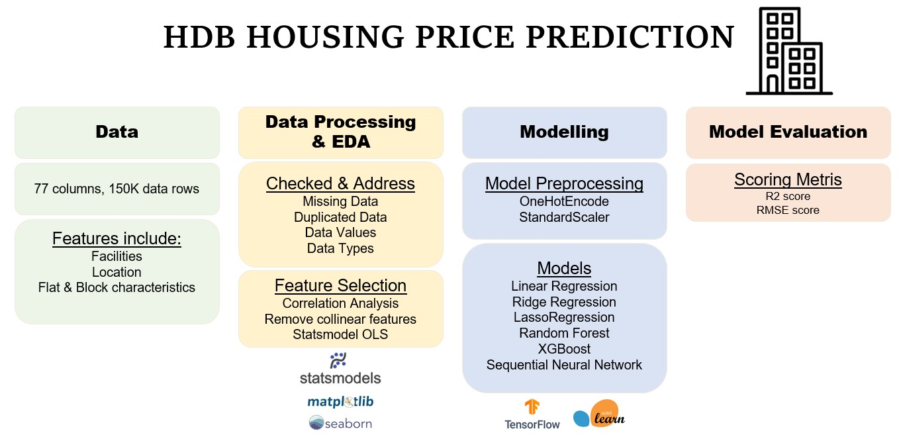
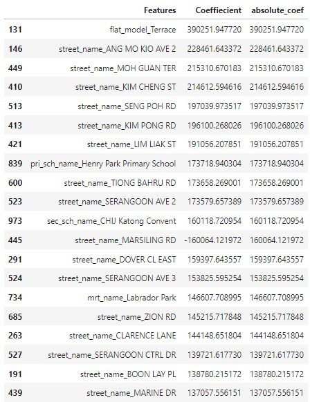
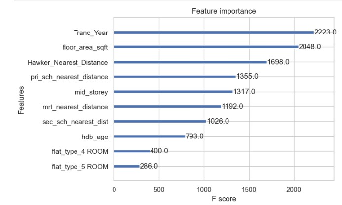

# Predicting HDB Housing Resale Prices
---
# About the Project

**Problem Statement** 
-  An entrepreneur wanted to set up a new property agency in Singapore.
- She collected a list of flat-related data, but did not know how to use the data to predict HDB resale flat prices nor how to quantitatively understand how the data impact prices. 

**Objectives** 
> - Develop a predictive model for the entrepreneur using supervised machine learning Linear Regression models
> - Explore features that have significant infuence on HDB prices

**Notebooks**

**README Overview** 
[1. Data](#ID1) 
[2. Approach](#ID2) 
[3. Models Performance](#ID3) 
[4. Discussion & Conclusion](#ID4) 

# 1. Data:
The data used in this project and its details can be found from [DSI-SG-Project-2 Regression Challenge](https://www.kaggle.com/competitions/dsi-sg-project-2-regression-challenge-hdb-price/overview).

The features belong to one of the following group:
1. Flat-related features
1. Block-related features
1. Transaction-related features
1. Location-related features
1. Facilities-related features

# 2. Approach:

|Approach|Description|
|:---|:---|
|Data Original size|77 columns, 150634 rows|
|Data Cleaning & Processing|<li>Duplications check</li><li>Data Values check</li><li>Drop Redundant or Similar features</li><li>Missing data and addressing them</li><li>Resulting dataframe has 52col,150634 rows|
|EDA|<li>1. Correlation</li><li>2.Outliers</li><li>3. More focused analysis at each feature types: Flat Characteristics, Block Characteristics, Transaction Period, Location and Facilities</li>|
|Modelling|<li>Categorical Features: OneHotEncoding</li><li>Numeric Features: StandardScaler</li><li>Regression Models: Linear Regression, Ridge Regression, Lasso Regression, Random Forest, XGBoost, Sequential Neural Networks</li><li>Metric: R2, RMSE</li>|

# 3. Models Performance:

# 3.1 First General Approach - Using Most of the features
Linear Regression, Ridge Regression and Lasso Regression are performed using aroud 50 features.

**Overview of Models explored:**
|Model|Description|Cross_validation score|R2 score|RMSE score|
|---|---|---|---|---|
|A: Linear Regression|Exclude 'address'|-3.1e+18|<li>Train:0.944</li><li>Test:0.941</li>|<li>Train:33966.9</li><li>Test:34668.3</li>|
|B: RidgeCV Regression|Exclude 'address'|0.941|<li>Train:0.944</li><li>Test:0.941</li>|<li>Train:33954.6</li><li>Test:34644.8</li>|
|C: Lasso Regression|Include 'address'|*unable to perform LassoCV or Cross-val score  due to computational limit*|<li>Train:0.956</li><li>Test:0.951</li>|<li>Train:30249.5</li><li>Test:31768.7</li>|

**Best Model: Model C - Lasso Regression** 
*Comment* 
- It has an RMSE score of 31769.
    - In other words, given a prediction of a resale flat price *K*, the true price would be within ~ *K* +/- $32k.
- Out of ~11K features after model-preprocessing, ~5K features have absolute coefficient>0, while ~6K features have 0 importance.
- Among these ~5K features, ~500 of them have absolute coefficient values distinctly greater than the others.
- These ~500 features mainly comprise of location-related features ('Latitude','address', 'street_name' and 'bus_stop_name')
    - This implies that location have great influence on resale price
    - It is likely because it accounts for the various facilities available in the vicinity.
    

**For example:ANG MO KIO AVE 2** 
It has multiple schools, bus stops, mrt station and parks around close vicinity in the area, making is very favourable. 
- *street_name_ANG MO KIO AVE 2* has a coefficient of 173358 (among top 20 coefficient values).
- in other words, if all else constant, a flat from ANG MO KIO AVE 2 would have $173,358 higher in resale price.

# 3.2 Second Approach - Using narrower selection of features, exploring more models
We narrow down to 15 features as we explore more computationally heavy machine learning methods (Ensumble Methods and Sequential Neural Networks)

|Model|R2 Train score|R2 Test score|RMSE Train Score|RMSE Test Score|Comments|
|---|---|---|---|---|---|
|Linear Regression|*Cross validation R2 score* -3.6e+17|0.932|36897|37172|Largely Overfitting comparing the crossval R2 score to test R2 score|
|RidgeCV|0.934|0.932|36889|37157|Improved performance compared to Linear Regression|
|LassoCV|0.896|0.895|46364|46256|Improved performance compared to Linear Regression|
|Random Forest|0.951|0.936|31675|36282|Improved performance compared to Linear Regression|
|XGBoost|0.977|0.965|21814|26742|Best Performing Model|
|Seq Neural Network|0.949|0.948|32384|32605|Improved performance compared to Linear Regression|

  
**Comments on best performing model - XGBoost** 
<code>XGBoost</code> gave the best performance despite using lesser features than before (15 vs 50 features) with R2 score of 0.96 and RMSE score of 26742 (meaning the predicted price differe $26K +/- from actual HDB resale price)

Housing prices are typically non-linearly related to their predictors, meaning that a linear model may not be able to capture the complex relationships between the predictors and the response variable. XGBoost is a tree-based model that can handle non-linearity well by partitioning the data into regions with different response values and using decision trees to make predictions.

**Comments on features with strong influence on HDB resale price:** 
TOP 20 Absolute Coefficient value from <code>RIDGE REGULARISATION REGRESSION</code> 

After removing <code>address</code> as a feature used for modelling, other location-related feature <code>street_name</code> appear to significantly influence the HDB prices. <code>street_name</code> related categories features appear very frequently among the features with top 20 absolute coefficient value.

That being said, we also noticed certain schools (e.g.Henry Park Primary School) and MRT stations (e.g. Labrador Park) have key influence on HDB prices as well.

XGBOOST FEATURE IMPORTANCE F-SCORE 
The F-score is a measure of a feature's importance that takes into account both the number of times a feature is used to split the data and the magnitude of the improvement in the objective function resulting from each split.

Features with higher F-scores are considered more important by XGBoost.

<code>TOP 10 F-SCORE FEATURES:</code> 

Here we can notice that more features are realised to have strong predictive importance in HDB prices such as <code>transaction year</code> and <code>HDB-age</code>, which is no surprise as we are familiar that generally prices are generally increaseing over the years, and older HDB flats may tend to have lower resale prices.

# 4. Concluding statements:

**Limitation and Furture work**
- It is clear that there can be many factors influencing HDB flat resale prices.
- Through this project, we can be more certain that location matters significantly.
- However, as seen in earlier EDA, other potential significant factors include key events like implementation of cooling measures.
- As such, in order to maintain accurate prediction of the HDB prices, it will require periodic training of the models with more recent data and explore expert's recognised pricing factors as well.

