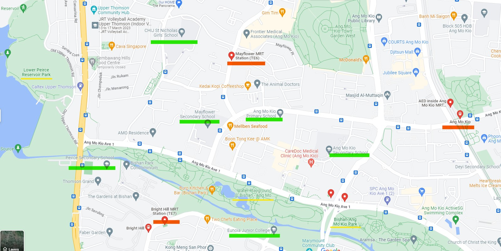

# Predicting HDB Housing Resale Prices
**Problem Statement** 
-  An entrepreneur wanted to set up a new property agency in Singapore.
- She collected a list of flat-related data, but did not know how to use the data to predict HDB resale flat prices nor how to quantitatively understand how the data impact prices. 

**Objectives** 
> Develop a predictive model for the entrepreneur

**Notebooks**

**README Overview** 
[1. Data](#ID1) 
[2. Approach](#ID2) 
[3. Models Performance](#ID3) 
[4. Discussion & Conclusion](#ID4) 

# 1. Data:
The data used in this project and its details can be found from [DSI-SG-Project-2 Regression Challenge](https://www.kaggle.com/competitions/dsi-sg-project-2-regression-challenge-hdb-price/overview).

The features belong to one of the following group:
1. Flat-related features
1. Block-related features
1. Transaction-related features
1. Location-related features
1. Facilities-related features

# 2. Approach:

|Approach|Description|
|:---|:---|
|Data Original size|77 columns, 150634 rows|
|Data Cleaning & Processing|<li>Duplications check</li><li>Data Values check</li><li>Drop Redundant or Similar features</li><li>Missing data and addressing them</li><li>Resulting dataframe has 52col,150634 rows|
|EDA|<li>1. Correlation</li><li>2.Outliers</li><li>3. More focused analysis at each feature types: Flat Characteristics, Block Characteristics, Transaction Period, Location and Facilities</li>|
|Modelling|<li>Categorical Features: OneHotEncoding</li><li>Numeric Features: StandardScaler</li><li>Regression Models: Linear Regression, Ridge Regression, Lasso Regression</li><li>Metric: R2, RMSE</li>|

# 3. Models Performance:
*Note: Due to the size of the data and limited computational memory, we are unable to run Linear Regression or Ridge Regression with 'address', nor could we run RidgeCV or LassoCV*.

**Overview of Models explored:**
|Model|Description|Cross_validation score|R2 score|RMSE score|
|---|---|---|---|---|
|A: Linear Regression|Exclude 'address'|-3.1e+18|<li>Train:0.944</li><li>Test:0.941</li>|<li>Train:33966.9</li><li>Test:34668.3</li>|
|B: Ridge Regression|Exclude 'address'|0.941|<li>Train:0.944</li><li>Test:0.941</li>|<li>Train:33954.6</li><li>Test:34644.8</li>|
|C: Lasso Regression|Include 'address'|*unable to perform  due to computational limit*|<li>Train:0.956</li><li>Test:0.951</li>|<li>Train:30249.5</li><li>Test:31768.7</li>|

**Best Model: Model C - Lasso Regression** 
*Comment* 
- It has an RMSE score of 31769.
    - In other words, given a prediction of a resale flat price *K*, the true price would be within ~ *K* +/- $32k.
- Out of ~11K features after model-preprocessing, ~5K features have absolute coefficient>0, while ~6K features have 0 importance.
- Among these ~5K features, ~500 of them have absolute coefficient values distinctly greater than the others.
- These ~500 features mainly comprise of location-related features ('Latitude','address', 'street_name' and 'bus_stop_name')
    - This implies that location have great influence on resale price
    - It is likely because it accounts for the various facilities available in the vicinity.
    

**For example:ANG MO KIO AVE 2** 
It has multiple schools, bus stops, mrt station and parks around close vicinity in the area, making is very favourable. 
- *street_name_ANG MO KIO AVE 2* has a coefficient of 173358 (among top 20 coefficient values).
- in other words, if all else constant, a flat from ANG MO KIO AVE 2 would have $173,358 higher in resale price.

# 4. Concluding statements:

**Limitation and Furture work**
- It is clear that there can be many factors influencing HDB flat resale prices.
- Through this project, we can be more certain that location matters significantly.
- However, as seen in earlier EDA, other potential significant factors include key events like implementation of cooling measures.
- As such, in order to maintain accurate prediction of the HDB prices, it will require periodic training of the models with more recent data and explore expert's recognised pricing factors as well.