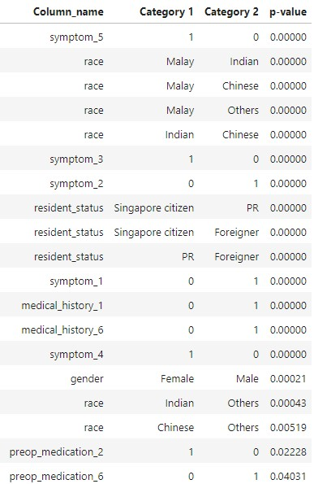

# Driving factors of Hospitalisation Bill
---
---
# About this project
As hospital data scientists, we aim to:
- Find factors that drive cost of hospitalisation cost for patients
- Find an effective way to estimate the hospitalisation cost for patients through modelling
    - Target performance (R2>90%, MAPE 10% or less)

## Approach

---
# Data Processing

---
# Data Analysis
## Summary of the data:
**TOTAL BILL PER HOSPITALISATION**

- Follow normal distribution
    - As the `Shapiro-Wilk` test shows p<0.05, we reject the null hypothesis that the distribution is not normal → it follows a normal distribution.
- The bill ranges from about 2.9K to about 99K.
- Average bill is about \$20K.
- 2.8% of the bill is very large and are outliers (\>\$44.5K)"

**DEMOGRAPHIC** 
Demographic analysis show similar distributions when analysis conducted across 3000 unique patients and 3400 hospitalisation case. 
|Feature|Observation|Remarks|
|---|---|---|
|Gender|Relatively balanced (50.1% : 49.9%)||
|Race|Chinese appears to be dominant racial group (63.7%)|Racial profile may influence hospitalisation bill because: <li>Different ethinicities predispose individuals to certain medical conditions ([reference](https://www.singhealth.com.sg/news/tomorrows-medicine/new-study-uncovers-genetic-risks-of-getting-disease-among-different-ethnicities-in-singapore))<li>Hospitalisation bill is influenced by the treatment received for medical conditions<li>It is possible we may observe a particular ethnic group tend to have higher/lower bill as a result of particular disease conditions that the ethnic group tends to have.|
|Resident Status|Singapore citizen  appears to be dominant group (80.1%)|Resident status have influence on hospitalisation bill, as it determines if the individual is eligible for government subsidies ([reference](https://www.guidemesingapore.com/business-guides/immigration/get-to-know-singapore/healthcare-in-singapore))|
|Age|<li>Generally two main groups of patients (Younger between 22-55yo) and (Older 55-85yo)<li>Middle-aged patients (40s-mid60s) dominates over young(20s - 30s) and senior individuals (above 65yo)| We may observe older patients with more complicatios which will require more complex medical attentions|

**HOSPITAL ADMISSIONS & DURATION**
- Most patients had only 1 admission in 2011-2015, with about 13% with multiple admissions.
- Hospitalisation duration range from 1 day to 20 days.
- Most patients hospitalisation duration is around 1 to 2 weeks.
    
**CLINICAL**
|Feature|Observation|
|---|---|
|`Lab Results`|Some outliers detected, but unable to comment further without understanding what are these lab results specifically
|`BMI`|Most of the patients do not have healthy body weight, mostly oerweight/obese
|**'MEDICAL HISTORY'**||
|`Number of medical history:`|<ul><li>Most hospitalisation cases have patient with at least one medical history<li>Some hospitalisation cases have patient with multiple medical history<li>Observed highest number of medical history is 5 out of 7.</ul>
|`Prevalence of each medical history`|<ul><li> Higher prevalence medical histories are `2`, `6` & `7`<li>Least prevalence medical histories are `4` & `5`.</ul>
|**SYMPTOMS**||
|`Number of symptoms`|<ul><li>Most hospitalisation cases have patient with at least 3 symptoms<li>Observed highest number of medical history is 5.</ul>
|`Prevalence of each medical history`|<ul><li> Highest prevalence seen for `symptom_4`<li>Least prevalence symptoms are `3` & `5`.</ul>
|**PRE-OP MEDICATION**||
|`Number of pre-op meds:`|<ul><li>Most hospitalisation cases have patient with at least 4 pre-op medications<li>Observed highest number of pre-op medications is 6.</ul>
|`Prevalence of each pre-op med:`|<ul><li>Highest prevalence pre-op med observed were 5 and 3<li>Least prevalence symptoms are 1 & 4.</ul>
## Potential factors influencing hospital bills identified:
### Linear Relationship with Quantitative variables
 
**COMMENTS** 
`Age_upo_admission` showed weak positive correlation with `total_hospital_bill`(r=0.33) 
`sum_symptoms` showed moderate positive correlation with `total_hospital_bill`(r=0.5) 
Other quantitative features does appear to have insignificant correlation with `r` close to 0

We can infer that patients older in age and patients with more symptoms tend to have higher hospital bill, likely due to greater medical care needed.
### Difference in hospitalisation cost among different Categorical classes
`Mann-Whiteney U test` is used to find statistical signficant difference in hospitalisation bill between the classes. If p<0.05, we reject null hypothesis, and infer that there is statistical significant difference in hospitalisation bill between the classes.
                                                                                                                                 
**Showing Categorical features with `Mann-Whiteney U test` p<0.05** 
 
 
- Significant difference in hospital bill distribution found among different gender, race and residential status
    - More evidently, from the violinplot, patient who were `foreigner` appear to have higher hospital bill
- Significant difference in hospital bill distribution also found among patient with and without certain medical histories, pre-op medication and symptoms
    - More evidently, from the violinplot, patient with `symptom_5` appear to have higher hospital bill

                                                                                                                              
---    
# Modelling

## Statistical Model Performance
**Showing top 5 performing model based on R2 test score**

**General Observations**
- The models perform generally well
- The simplest model Linear Regression using all the original datasize and columns performs well without overfitting, with test R2 score of 93%
- There is no overfitting as the differene between train and test R2 score is <5%
- The models are also not underfitting, in fact, performs well on test set with general R2 score>90% and MAPE <10%, which meet our initial target model metric performance.
- While all the models appear to have very similar performance (R2 range narrowly between 90-94%), we would like to zoom in a little more to observe differences in performance across the differet approach.
- Among the Elastic Net models, the better performing models have l1_ratio of 0.9: favor L2 Lasso regularisation.
                                                                                                                    
`All columns` appear to give better model performance. 
`4-fold` data size appear to give better model performance. 
`Elastic Net` appear to perform better than other statistical models. 
These are identified as these models appear with higher R2 score than their counterpart models.

Furthermore, it make sense as: 
`All columns` allows more columns subjected to the regularization. 
`4-fold` allows model to train better with better representation of the population 
`Elastic Net` allows use of l1 and l2 regularization 

## Machine Learning Model Performance

### RandomForestRegressor:
- The models perform generally poorer than statistical models which has R2 score 90-94%, while the RandomForestRegressors have R2 score 87-92.5%.
- The best model in this section is `RandomForestRegressor_4fold_sub3col` with test R2 of 92.5% and train-test R2 difference of 4.8%.

There are a few interesting observations in our exploration with `RandomForestRegressor`:

|Observation|Remarks|
|---|---|
|`Variance-bias tradeoff`|As the hyperparameter tunes and obtain `lower variance`, it reduces the gap between train and test metric (model less overfitting). Meanwhile, we observe that the model's performance on the test set reduces as the bias increases.|
|Model performance generally across different column set|<li>On given range of hyperparameters we experimented on, models using `sub3col` columns performed best on test set with `R2` score around 92% , VS other models thats 90% or less.<li>Recap `sub3col` contains transformed features with do not have close-to-zero coefficients in penalized regression model<li>We can infer that `RandomForestRegressor` performs better on unseen data when it is being trained on 'important' features on the hospital bill, while tends to have lesser performance when given other 'less' important features.|
### XGBRegressor VS RandomForestRegressor:
 - XGBRegressor generally performs better than RandomForestRegressor
- RandomForestRegressor performs better when trained on specific important features, while XGBRegressor showed better performance when more columns (it perform least  well on `sub2col` which had least columns)
- We can infer XGBRegressor is better selecting important features and this is make sense:
    - XGBoost offers the ability to adjust regularization parameters, granting users precise control to fine-tune the complexity of the model. It provides choices like L1 and L2 regularization, which aid in mitigating overfitting and enhancing generalization. 
    - In contrast, Random Forest Regressor relies on the natural randomness inherent in its ensemble construction to regulate the model, lacking direct influence over regularization parameters.
## Summary of all models performance
|Modelling Approach|Description|
|---|---|
|Statistical Model|<li>4 Model types: Linear Regression, LassoCV, RidgeCV, ElasticNetCV <li>9 X data sets used<li>Total 36 trained statistical models  <li>Not overfitting (Train-test R2 score difference less than 5%)<li>Well performing with >90% R2 test score.<li>Very similar performance with R2 test score ranging narrowly 90-94%|
|Machine Learning Model|<li>2 Model types: RandomForestRegressor, XGBoostRegressor<li>4 Xdata sets used (Datasize: 4fold, Column set: allcol, sub1col, sub2col, sub3col)<li>Total 8 trained machine learning models  <li>`RandomForestRegressor` appear to perform similar or poorer than the statistical modesl with R2 score ranging from 87.6% to 92.5%<li>`XGBRegressor` appear to perform best with R2 score around 98% without overfitting, except when using `sub2col` which has the smallest set of columns.|
    
Selected Best Model: `XGBRegressor_4fold_sub3col` 
- Rationale: The models peformance across other 2 XGBRegressors are similar. We then look at the columns used. We selected the model that used the selected important features identified from statistical modelling as these are the key features identified through modelling (compared to the other approach which is through pre-modelling simpler analysis).
- `R2 score` 97.8%
- `MAPE score` 4.76%
- `R2 score` 1318
    
What this translates to is: 
- Given a patient information during hospitalisation (found in `sub3col`), it is able to estimate the hospital bill with about 5% and SGD 1.3K off the true bill value. 
---
# Feature Importance (Key Drivers of Cost)
 
 
  
- Generally, top features identified post-modelling are also identified in the analysis conducted during data analysis.
- Most notable features are Resident Status, Race (Malay), Sum of symptoms and Symptom_5
- Medically, a patient tend to have higher bill if they have more symptoms, or particularly symptom 5, as they would require more treatments or more complex treatments.
- Resident Status evidently affects hospital bill as we are aware it affects one’s eligibility to subsidies. (Foreigners are not eligible to subsidies and will tend to see much higher bill, which we also observed earlier in statistical model coefficient chart)
- Malay patients may observe higher hospital bills, possibly due to higher prevalence of certain medical conditions and treatment needed that are more costly. However, more medical background information would be preferable to assess this possibility.

---
## Conclusions

We have met out aims of the task: 
**Aim of the project**:
1. Find factors that drive cost of hospitalisation care
    - `Resident Status`: Foreigners have higher cost of care
    - `Race (Malay)`: Malay have higher cost of care
    - `Sum of symptoms`: More symptoms tend to have higher cost of care
    - `Symptom_5`: Having this symptom tend to have higher cost of care
1. Find ways to estimate hospitalisation cost (through modelling):
    - Selected model`XGBRegressor_4fold_sub3col`
    - `R2 score` 97.8%
    - `MAPE score` 4.76%
    - `R2 score` 1318
    - What this translates to is:
        - Given a patient information during hospitalisation (found in `sub3col`), it is able to estimate the hospital bill with about about 5% and SGD1.3K off the true bill value. 
        
**Limitations**
1. Did not explore non-linear relationship between hospitalisation bill with other quantitative features:
    - Such non-lineaer relationships if identified will allow us to obtain other prominent quantitative cost driving factors, as we observed minimal of these among the other important features assessed post-modelling.
    - We can achieve this by transforming the quantitative variables (log2, exponential, square root, polynomial transformations) and assess their correlation with the hospital bill
1. Patient's personal and family financial well-being not accounted for:
    - This affects the level of subsidy a patient is eligible for, which will significantly affects a patient's bill ([as high as 80% subsidies](https://www.moh.gov.sg/healthcare-schemes-subsidies/subsidies-for-acute-inpatient-care-at-public-healthcare-institutions))
1. Patient preference:
    - Patient's perference in choice of basic VS premium services affected the hospitalisation cost
    - For example, in [Singapore General Hospital](https://www.sgh.com.sg/patient-care/inpatient-day-surgery/type-of-wards-singapore-general-hospital), a class C ward which has 8 beds in a room cost SGD37 a day, compared that to class A ward which is a single room cost SGD 540 a day
    
**Concluding Statements** 
We have achieved what the task set out to do. We also identify there is limited information in the data set and further analysis that could have been explored. The use of other advanced machine learning models could be further explored as well (such as deep learning models), which has also shown great results as seen in [price estimator model by UCARE.AI](https://www.ucare.ai/wp-content/uploads/2018/12/Joint-Media-Release-Parkway-Pantai-and-UCARE.AI-launch-AI-powered-predictive-hospital-bills-estimation-system-with-pic-20181213.pdf). 

AI has so much potential in not only in the advancement of medical treatments, but also in the delivery of these treatments through our healthcare systems. We can look forward to discovery new innovative ways to advance our healthcare systems as the world continues to see rising demands of medical needs.
