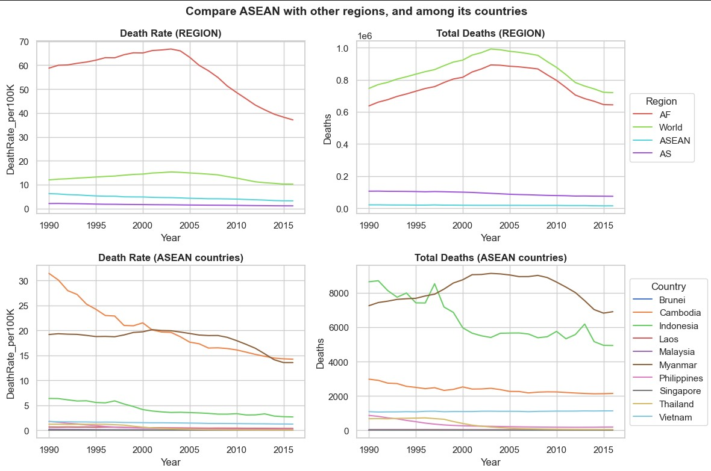
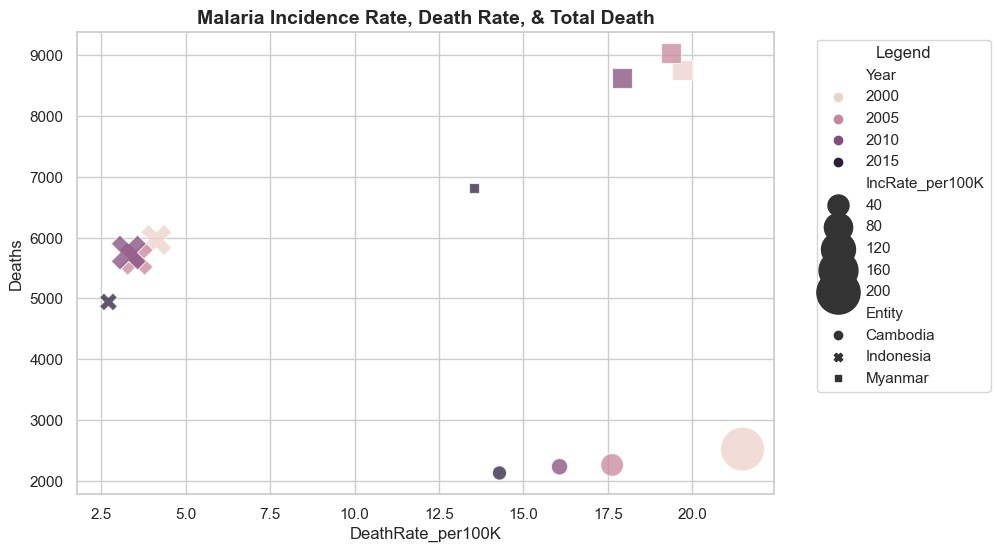
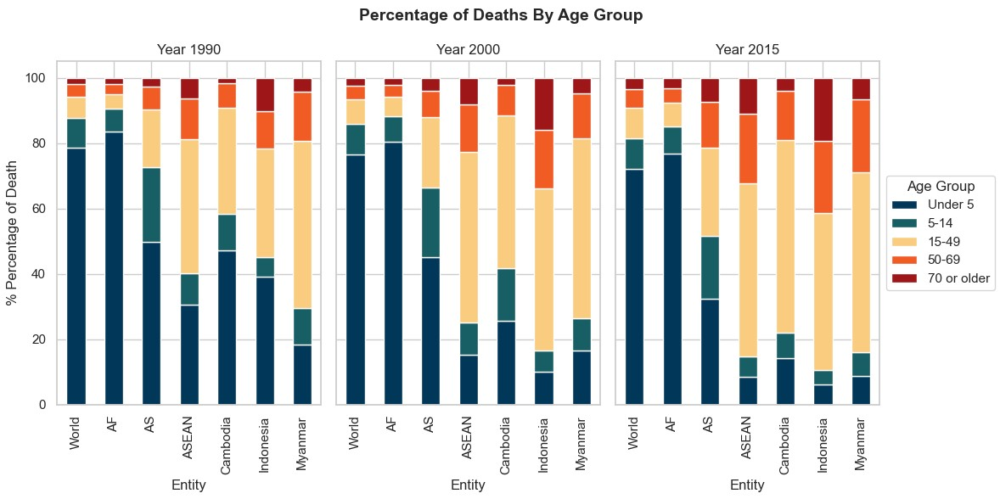

___
# Data Analysis: Malaria in ASEAN
___
## BACKGROUND
**Goal**: To provide insights about the malaria situation in ASEAN countries (with respect to the rest of the world, and within the ASEAN countries themselves).

**Datasets**:
About the datasets:
- There are three malaria datasets
    - Malaria Deaths per Age Group (age_grp_death_df)
    - Malaria Death Rate (death_rate_df)
    - Malaria Incidence Rate (inc_rate_df)
   
**Definitions**
|*Term*|*Definition*|
|---|---|
|Death rate|The number of deaths from malaria per 100,000 people.|
|Incidence rate|The number of new cases of malaria in a year per 1,000 population
at risk.|
|Deaths/ Total Deaths|Annual number of deaths from malaria.|

**Source**:  [Our World in Data](https://ourworldindata.org/malaria#)

**Notebook Description**:
01_DataCleaning:
- Inspect and clean the data, include identifying missing and duplicated data
02_EDA_Visualisation:
- Process the data and perform data visualisation.
- Visualisation charts focus on examining malaria deaths, death rate and incidence rate in ASEAN, and in relative to other parts of the world.

---
## Exploratory Data Analysis:
---
### Fig.1 Compare ASEAN with other regions, and among its countries

 

ASEAN countries malaria death rates and total death are being compared to the other regions, as well as within the ASEAN countries.

|**OBSERVATION**|**DESCRIPTION**|
|---|---|
|General observations (Regional):|<li>`AFRICA` (AF) had highest malaria death rate across the years, notably higher that of the `World`. <li> `World` total malaria death across the years is evidently influenced by the total deaths in `Africa`.|
|ASEAN vs rest of the world|<li>`ASEAN` malaria death rate is notably lower than that the `World`<li>Interestingly `ASEAN` malaria death rate is **higher** than that of `Asia`(AS), the continent group that ASEAN is part of.|
|Among ASEAN countries|<li>Top 3 countries with highest malaria death rate and total malaria death across the years are `Cambodia`, `Indonesia` and `Myanmar`.<li> `Myanmar` generally had highest death rate and total death among the ASEAN countries<li> Meanwhile, between `Indonesia` and `Cambodia`, `Myanmar` had higher death rate than that of `Indonesia`, but much lower total malaria deaths than `Indonesia`. <li>Let's examine in greater detail in the following chart comparing these 3 countries.|
    
---
### Fig.2 Compare ASEAN with other regions, and among its countries

 
    
Top 3 ASEAN countries are being compared on Incidence Rate, Death Rate, & Total Death:
- The shape represents each country.
- The marker colour represents the year (darker tone, more recent years)
- The marker size represents the malaria incidence rate that year.
- The axis shows the malaria death rate against total deaths.

|**OBSERVATION**|**DESCRIPTION**|
|---|---|
|General Observation|<li> Consistent with earlier chart (Fig. 1) `Myanmar` (square) had higher malaria death rates and total deaths compared to the other two countries.<li>Meanwhile, between `Indonesia` and `Cambodia`, `Myanmar` had higher death rate than that of `Indonesia`, but much lower total malaria deaths than `Indonesia`.
|Incidence Rate|<li>Notably, all 3 countries observed decreased incidence rate across the years, as observed we observe the darker their marker, generally smaller its size.<li>`Cambodia` had highest incidence rate among the countries earlier on in 2000, but it had the greatest reduction in incidence rate over the years.<li>`Indonesia` observed some increase in incidence rate in 2005 and 2010, but had also observed drastic drop in 2015.<li>`Myanmar` observed consistent incidence rate initially, but had a reduced incidence rate in 2015.|
|Death Rate|While `Indonesia` generally had lower death rate than the other two countries, it had smallest reduction in death rate over the years|
|Total Deaths|`Myanmar` observed greatest drop in total malaria deaths, while `Cambodia` observed the least.|
    
**REMARKS: INCIDENCE VS DEATH**
- Monitoring the malaria incidence and death allow us to recognise the gaps in the countries malaria management.
- While the incidence rate reflects effectiveness of ongoing malaria prevention efforts, the death rate allow assessment on the countries effectiveness in treating malaria infected patients.
- The chart showed the countries efforts in preventing malaria had been effective as seen in the drop in incidence rate.
- However, despite some reduction in death rate and total deaths, the countries showed they have much more to work on to keep malaria death low. 

---
### Fig.3 Compare Age Group Percentage Deaths

 

Top 3 ASEAN countries Age Group Deaths compared to regions and world (Year 1990, 2000, 2015):
- According to [Our Wordl in Data](https://ourworldindata.org/malaria#), at a global level, the most vulnerable age group to malaria deaths are children under five years old.

|**OBSERVATION**|**DESCRIPTION**|
|---|---|
|Age Group making up largest % of yearly malaria deaths|<li> Consistent with `Our World in Data`, Children under 5 years old had been the most vulnerable group to malaria deaths in `Asia`(AS), `Africa`(AF) and the `World`.<li> Interestingly, especially in the more recent years, children and youths (under 15 years old) were not the age group making up largest proportion of total malaria deaths in ASEAN.<li>Generally, `ASEAN`,`Cambodia`,`Indonesia` and `Myanmar` observed age group 15-49 making up largest proportion of total malaria deaths in 1990,2000 and 2015 (*except in Cambodia 1990, when children under 5 years old have higher deaths*).<li>Proportion of deaths contributed by children under 5 in `Asia`, `ASEAN`,`Cambodia`,`Indonesia` and `Myanmar` had notably declined over the years, but not the case in the `World` and `Africa` whose % Deaths by this age group remain above 70%.|