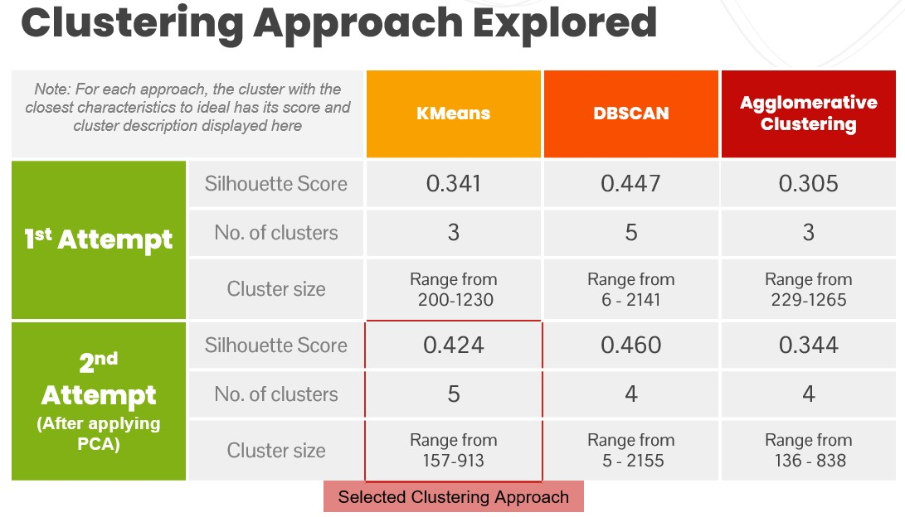

# Retail Customers Segmentation
---
*An Unsupervised Machine Learning Project - Exploring Clustering methods and Feature reduction with Principal component analysis (PCA)*

# About this Project
This is a marketing analysis project that explores unsupervised machine learning techniques (clustering and PCA) to categories customers to strategies marketing efforts. The aim is to segment the retail customers based on their consumer behaviour, and anlyse their profiles to gain insights for marketing plans.

# The Approach

# The Data

**The features are divided into the 4 feature groups (Place, Product, Promotion, People)**
1. People
1. Place
1. Product
1. Promotion

**People**

1.  ID: Customer's unique identifier
1.  Year_Birth: Customer's birth year
1.  Age: Customer's age (NEW)
1.  Education: Customer's education level
1.  Marital_Status: Customer's marital status
1.  Income: Customer's yearly household income
1.  Kidhome: Number of children in customer's household
1.  Teenhome: Number of teenagers in customer's household
1.  KidTeenhome: Number of children & teenagers in customer's household (NEW)
1.  Dt_Customer (Enrollment_date): Date of customer's enrollment with the company
1.  Recency: Number of days since customer's last purchase
1.  Complain: 1 if the customer complained in the last 2 years, 0 otherwise

**Product**

1.  MntWinesProducts: Amount spent on wine in last 2 years
1.  MntFruitsProducts: Amount spent on fruits in last 2 years
1.  MntMeatProducts: Amount spent on meat in last 2 years
1.  MntFishProducts: Amount spent on fish in last 2 years
1.  MntSweetProducts: Amount spent on sweets in last 2 years
1.  MntGoldProducts: Amount spent on gold in last 2 years
1.  TotalAMntspent:Total amount spend in last 2 years (NEW)

**Promotion** 
1.  NumDealsPurchases: Number of purchases made with a discount
1.  AcceptedCmp1: 1 if customer accepted the offer in the 1st campaign, 0 otherwise
1.  AcceptedCmp2: 1 if customer accepted the offer in the 2nd campaign, 0 otherwise
1.  AcceptedCmp3: 1 if customer accepted the offer in the 3rd campaign, 0 otherwise
1.  AcceptedCmp4: 1 if customer accepted the offer in the 4th campaign, 0 otherwise
1.  AcceptedCmp5: 1 if customer accepted the offer in the 5th campaign, 0 otherwise
1.  Response (AcceptedCmpLast): 1 if customer accepted the offer in the last campaign, 0 otherwise

**Place**

1.  NumWebPurchases: Number of purchases made through the company’s website
1.  NumCatalogPurchases: Number of purchases made using a catalogue
1.  NumStorePurchases: Number of purchases made directly in stores
1.  NumWebVisitsMonth: Number of visits to company’s website in the last month

# EDA: General Observations

**CONSUMER BEHAVIOUR SUMMARY**

|Behaviour|Description|
|---|---|
|EXPENDITURE|<li>There is a bulk of customers spending <500 in last 2 years<li>There is a bulk of customers spending above 900 in last 2 years<li>There is significantly more expenditure on WINE & MEAT compared to other product types|
|CAMPAIGN OFFERS|<li> Generally acceptance rate for all campaign offers are low (avg 160)<li>73% Customers did not accept any campaigns<li>Last Campaign received the highest acceptance (300+)|
|PLACE OF PUCHASE|<li>Store is the most popular place of purchase (12.8K purchases in last 2years<li>Majority (64%) of customers viewed the website 5-10 times last month<li>There is a bulk of customers making 2-6 purchases in past 2yrs<li>There is a bulk of customers making 10-25 purchases in past 2yrs|
    
**CUSTOMER DEMOGRAPHIC SUMMARY**

|Demographic|Description|
|---|---|
|ENROLLMENT|Most of the months observed 90-110 customers enrollment per month|
|AGE|<li>The most frequent age ranged around 35 to 50, followed by 55 to 70<li>There are a couple of senior customers with age >100|
|INCOME|<li>The distrubution of the customers income is relatively balance below and above the median income (~50K)<li>The income mainly lies within the IQR of about 35K - 50K<li>There is a few exceptionally high income above 150k.|
|KIDS & TEENS AT HOME|<li>Around half the customers have kid(s) at home.<li>Around half the customers have teen(s) at home.<li>Aroud 30% of the customers do have any kid or teen at home|
|RECENCY OF PURCHASE|Recency (customer last purchase) is relatively evenly distributed from 10 to 100 days|
|COMPLAIN| only 21 customers made a complain in the last 2 years|
|EDUCATION|<li>Graduate makes up majority of the customers<li>Undergrates is the smallest education group among customers|
|RELATIONSHIP|~65% customers are Attached|
    
**CORRELATIONS SUMMARY**
||Observation|Remarks|
|---|---|---|
|Significant Relation with Income|Income appear to have many many significant positive correlations with Purchases and Expenses related columns (r>5)|This makes sense as higher income consumers have higher spending power to have higher expenses and more purchases.|
|Kids & Teens at home|Consumer with kid/teen: (1) have lower amount spent on Meat products (r = -0.5) (2) have lower total amout spent (r = -0.5)|This is possibly explained by their need to balance their financial resources with other expenses related in raising their child/teen|
|Campaigns|The Total campaigns offers accepted showed significant correlationship with acceptance of Campaigne 1, 4, 5 and the last campaign|Meaning customers who have higher total numbers of campaigns offer acceptance tend to accept offers by these sepcific campaign|
|Place of purchase|<li>Customers who tend to have higher Store purchases also have higher Web purchases and Catalog purchases (r>0.5)<li>That relationship between Web purchases and Catalog purchases is not as strong (r = 0.4)<li>It is also noted number of web visits last month has signigicant inverse correlation with number Catalog purchases (r = -0.52)|<li>Given that Store is most popular place of purchase, it is reasonable to relate high Store purchases are consumers who have higher purchases generally even in other places.<li>Customers who have higher web visits would less likely to make Catalog purchase, likely because they will more likely opt for Web purchase|
    
# Clustering Methods

    

# Cluster Profiling & Marketing Strategies
Let's look at the cluster overview and relate the findings to possible marketing strategies.

