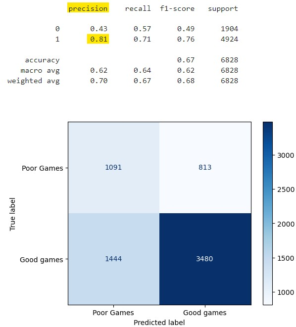

# Streamlit Game Success Estimator
---
This is an overview of the project.

**Notebooks** 
01_DataCollection 
02_DataCleaning_EDA 
03_BaselineModel 
04_Improved_Model 

# Introduction:

***Problem statement***: 
It is not unknown of that investment is a balance of risk and benefit. In the gaming industry, it is very dynamic and maybe challenging to determine is a game is worth investing in. As such, we aim to create a classification model that will improve investment chance of successful investment in  pre-released or early-accessed games by looking into the <code>game's description</code>.

We look at a <code>'Good Game'</code> or  *'Successful' game*: a game well received by users, in other words, games which received largely positive reviews. 

So our main focused feature is the <code>game description</code>, and our target variable is whether a game is a <code>'Good Game'</code>.

The model performance will be compared and assessed against the investment chance of investing in a successful game without using the model (default probability = percentage of defined 'Successful' games in the dataset). As such, our main assessment metrics of the model is it's <code>**precision**</code>.

Our focused and dataset will be on the games from [*Steam*](https://store.steampowered.com/). However, we would wish for the model to be applicable to other game websites/platforms as well.

# Data Collection, Proccessing and Analysis:

|Phase|Process involved|Remarks|
|---|---|---|
|Data Collection| <li>Beautiful Soup</li><li>Selenium</li>|50k rows with 7 columns:  <li>Title</li><li>Url</li><li>Review</li><li>Game Description</li><li>User-defined tags</li><li>Released date</li><li>Price</li>|
|Data Cleaning|Check and address if necessary: <li>Missing Data</li><li>Duplicate Data</li><li>Unhelpful data (e.g. Games with no reviews)</li><li>Data types</li><li>Outliers</li>|Data collected contain 50K data rows and 7 columns.Resulting datadframe after cleaning has 49+K data rows and 7 columns.|
|Data Processing|**Review-related columns**  Extracting numerical data from the information in 'Review', such as *Total Reviews* and *Percentage of positive reviews* and creating new feature columns|Some games do not have reviews or have insufficient reviews to be given a 'review type' (*Positively, Mixed or Negatively reviewed*)   Such games are dropped, resulting dataframe with 27+K data rows and 10 columns.|
|Target variable column: <code>Good Games</code>|**Good Game or Poor Game**  We followed how *Steam* labelled a game as postive review type; games that are classified as 'Positive' reviewed are the games with at least 70% of postive reviews. Such game are classified as 'Good' game, else they are 'Poor' games.| Resulting dataframe contains 27+K data rows and 11 columns.|
|EDA|<li>Correlation analysis</li><li>Distribution</li>|Some key findings from EDA:  <li>**About 72% of the games are 'Good' games. </li><li>As such, <code>our model aims to give precision much higher than 72%.**</code></li><li>A correlation anlysis there does not appear an obvious correlation between price, total reviews and year of game release to the percentage of positive reviews.</li><li> Majority of the games were released from 2017 onwards. Possibly this was the year where Steam has been more actively recorded game data.</li><li>The games generally received 60% positive reviews.</li><li>About 75% of the games have 90 or less number of reviews</li>|

# Baseline Model (Preprocessing, modelling, evaluation)

**Process involved**:
>CountVectorizer(stop_words = 'english',max_features=1500)

**Model used**:
>Random Forest

**Performance**:
> 

**Comments**:

In the interest of answering our business problem, our focus is mainly on precision (% of True 'Good Games' among those who are predicted to be 'Good Games'.)
- While the model has good recall(0.99), it has poor precision (precision = 79% VS 72% actual 'Good Games' in the test set).
- This will does somewhat well for our stakeholder, as the chances of them obtaining a 'Good Game' did increased by 7% with the use of the model.

**How are we going to improve model's performance?**
1. Explore using different choice of model (e.g. Random Forest)
1. Include Stemming/Lemitisation during preprocessing
1. Apply conditions such as *min_df* and *max_df* during vectorisation
1. Attempt using TFIDF vs CountVectorizer
1. Attempt searching for Bigrams

# Overview of the Models explored and their performance:

|Model|Description|Performance|
|---|---|---|
|Baseline Model Multinomial Naive Bayes|Processes:  CountVectorizer|<li>Score to beat: 72% <li> Model Precision score: 79%|
|Approach 1: Random Forest|Processes:  CountVectorizer|<li>Score to beat: 72% <li> Model Precision score: 73%|
|Approach 2: Multinomial Naive Bayes varying Vectorizer used|Processes:  CountVectorizer TfidfVectorizer|<li>Score to beat: 72% <li> Models Precision score 72-76%|
|Approach 3: Multinomial Naive Bayes varying Vectorizer used  Limited to datasets with minimally 50 reviews|Processes:  CountVectorizer TfidfVectorizer|<li>Score to beat: 77% <li> Models Precision score 77-83%|
|Approach 4: Multinomial Naive Bayes Excluding common NGrams tersm|Processes:  CountVectorizer|<li>Score to beat: 72% <li> Models Precision score 80%|
|Approach 5: Complement Naive Bayes Excluding common NGrams tersm|Processes:  CountVectorizer|<li>Score to beat: 72% <li> Models Precision score 81%|

# Discusssion and Conclussion:

Our final selected best model (Complemet Naive Bayes) improve the investors chance of investing in 'Good' games from default probability of 72% to 81%.
>
    
**Limitation**
1. Limited number of reviews (e.g. <50 reviews) may have insufficient to determine if a game is 'Good' or 'Poor'. However, by limiting the dataset to only games with at least a certain number of reviews will significantly reduce the number of available dataset available for analysis and model training.
    - There need to be a balance between the accuracy of labelling a game as 'Good' or 'Poor' and having enough dataset for training model to do differentiate a 'Good' and 'Poor' game.
    - In our final selected model, we worked around this challenge by analysing common terms found in the two classes of games by focusing only on games with at least 50 reviews. We subsequently applied that resulting model approach and target terms filtering on the entire dataset which gave us our best performace.
    - Analysis could have been on comparing the games total number of reviews between correctly and wrong predicted games.
1. Game industry is ever-changing, the model will have to be revised to capture new and upcoming trends.
1. Some features that can greatly determines a game's success may not be captured in the game's description,such as game developers and programmers.
    - such features can be explored and analysed to incorporated to improve model performance.
1. The game has poor specificity (~50%); it is not able to pick up actual poor games well.
    - This is due to lack of information the model needs to identify a game that is actually poor.
    - Features of poor games may be explored and obtained through examining games' negative reviews itself. User's description of why they find a game is 'bad' can give insights on improving the model's ability to detect actual 'True Negatives'
    
**Conclusion**: 
Recognising our model's strengths and flaws, what does this mean for our model?  What is it place of use in the business context?

> - Investors should use the model to identify potential games for investing while recognising it does not capture other important information making the ultimate call whether a game should be invested or not.
> - The model ultimately narrows down the canditates of games for further consideration for investing, which makes the selection phase much more efficient.
> - While this would mean some opportunity cost (due to False Negative predictions), it is worth noting that it can be overcome by setting a target number of games to invest in, and achieving that target number while being able to save time and resources in the selection and decision making process.